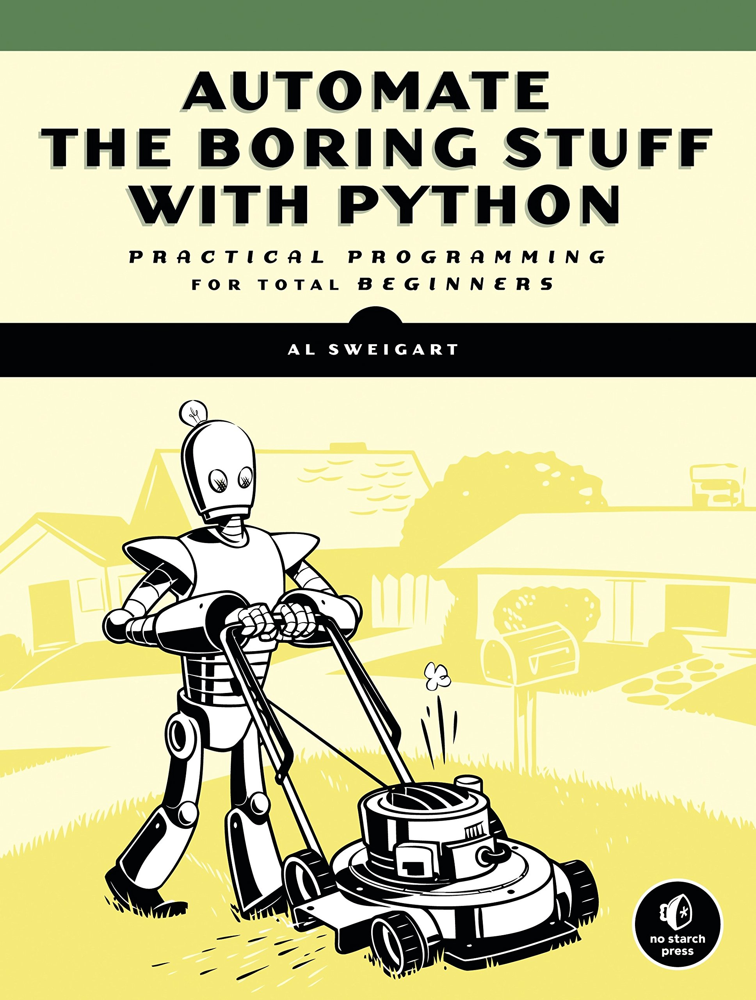

# Scripts: Automate The Boring Stuff
> This repo encompasses projects that were built from project assignments within the 'Automate the Boring Stuff with Python' book by Al Sweigart. If scripts entail more than the main script file itself, then it will have it's own folder. Otherwise each indivdual script is separate from other scripts within the repo. 



## Environment Setup

1. Install Python (Linux-oriented)
```$ sudo apt-get update```  
```$ sudo apt-get install python3.8```  

3. Set up virtual environment (recommended, not required)
*Version/path dependent on your Python installation*
```sudo apt-get install python3-pip```
```pip install virtualenv```
```python3 -m venv env```

4. Activate virtual environment from working directory in repository
```source env/bin/activate```

5. Download requirements.txt file to your working repository, then install required packages via pip
```pip install -r requirements.txt```

## Running a script
```python scriptname.py```
